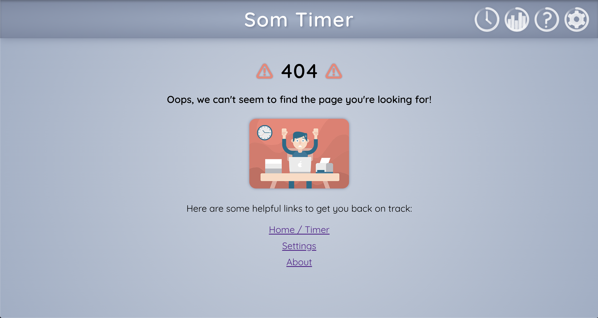

[![Contributors][contributors-shield]][contributors-url]
[![Issues][issues-shield]][issues-url]
[![Issues][issues-closed-shield]][issues-closed-url]

# 
Som Timer

Som Timer is a timer that cares. Based on the Pomodoro technique™️, this application provides users with curated wellness content during break intervals. Build in rest, so you can focus best.

This application was created as our capstone project for the Front End Engineering program at the Turing School of Software & Design. 

Som Timer won 2nd place at [Turing's demo competition](https://www.linkedin.com/feed/update/urn:li:activity:6742110162330484736/) in November of 2020 as decided by a panel of industry judges and the Director of the Turing School.

[Deployed Front End](https://som-timer.herokuapp.com/) | [Deployed Back End](https://som-timer-be.herokuapp.com/)

## Table of Contents

- [Installation Instructions](#installation-instructions)
- [Project in Action](#project-in-action)
- [Tech Stack](#tech-stack--external-libraries)
- [Future Directions](#future-directions)
- [Back End Information](#back-end-information)
- [Contributors](#contributors)

## Installation Instructions
If you would like to install the repos locally instead of visiting the deployed sites, follow these directions:

1. Clone down the [Front End Repository](https://github.com/SOM-Timer/som_timer_fe) by running `git clone git@github.com:SOM-Timer/som_timer_fe.git <...>` in the terminal, where `<...>` is an optional argument to customize the name of your local repo.
2. Run `npm install` to install necessary dependencies
3. Navigate to the root directory and run `npm run start` to view the app in action.

## Project in Action

#### Timer Cycle Part 1
Users can set a timer for a focus interval and then be served wellness content from their selected category during breaks. 

#### Timer Cycle Part 2
After the break content is complete, users return to the focus interval timer. Mood is also rated before and after the break content. 

#### Mood Selection
When users visit our mood selection screen, they are met with a pleasing aesthetic and visual indications of their interaction with the form. Any time a face is clicked on, the others fade away a bit. If a user attempts to click the submit button without selecting a face, they receive a warning message.

#### Changing Settings
Users can customize their focus and break intervals, as well as the audio clip that will be used to notify them when the focus interval has ended. 

#### Dynamic Timer Settings
On the main timer view, the heading will change based on whether the user has not yet begun the timer, it is playing, or if it is paused.

#### 404 Page
If users visit a url that does not exist, they receive a 404 message with helpful links to get back on track.

#### About Page
When users visit the About Page, they receive information about our application, the pomodoro technique, and the contributors.

## Tech Stack & External Libraries
- React
- React Hooks
- React Context API
- SCSS
- React Testing Library
- Jest
- [Notifications API](https://developer.mozilla.org/en-US/docs/Web/API/Notifications_API)
- [React Compound Timer](https://github.com/volkov97/react-compound-timer)
- [React Player](https://github.com/CookPete/react-player)
- [React Toastify](https://github.com/fkhadra/react-toastify)
- Google OAuth

## Future Directions
This current version of the app is just the beginning, and we would like to significantly expand our scope. The following are our plans for future iterations: 
#### Expand customization
  - We want to ensure that Som Timer works well for all users, so we would like to expand our customization options on the Settings page. Current ideas for this include adding the ability to toggle between themes, such as light and dark mode, and select the categories of content the user can then choose from during breaks. 
#### Allow a user to upload content
  - In the vein of expanding customization, we would also like to give the user the ability to add new content to their personal library by uploading links from YouTube, Vimeo, SoundCloud, and other platforms. 

## Back End Information

- [Back End Som Timer Repo](https://github.com/SOM-Timer/som_timer_be)  
- [Back End Som Timer Ruby Gem](https://github.com/SOM-Timer/som_timer_gem)

## Contributors
Front End Developers
  - Aaron Burris-Deboskey: [GitHub](https://github.com/Abdeboskey) | [LinkedIn](https://www.linkedin.com/in/aaron-burris-deboskey/)
  - Jake West: [GitHub](https://github.com/jkwest-93) | [LinkedIn](https://www.linkedin.com/in/jake-west-3840b71b4/)
  - Rachel Williams: [GitHub](https://github.com/rwilliams659) | [LinkedIn](https://www.linkedin.com/in/rachelsarahwilliams/)  

Back End Developers 
  - Chandler Hulstrom: [GitHub](https://github.com/Chulstro) | [LinkedIn](https://www.linkedin.com/in/chandler-hulstrom-34ab81150/)
  - Dorion: [GitHub](https://github.com/sciencefixion)
  - Sienna Kopf: [GitHub](https://github.com/sienna-kopf) | [LinkedIn](https://www.linkedin.com/in/sienna-kopf-b22b701b1/)

<!-- MARKDOWN LINKS & IMAGES -->
[contributors-shield]: https://img.shields.io/github/contributors/SOM-Timer/som_timer_fe.svg
[contributors-url]: https://github.com/SOM-Timer/som_timer_fe/graphs/contributors 
[issues-shield]: https://img.shields.io/github/issues-raw/SOM-Timer/som_timer_fe
[issues-url]: https://github.com/issues-raw/SOM-Timer/som_timer_fe/
[issues-closed-shield]: https://img.shields.io/github/issues-closed-raw/SOM-Timer/som_timer_fe
[issues-closed-url]: https://github.com/issues-closed/SOM-Timer/som_timer_fe/
